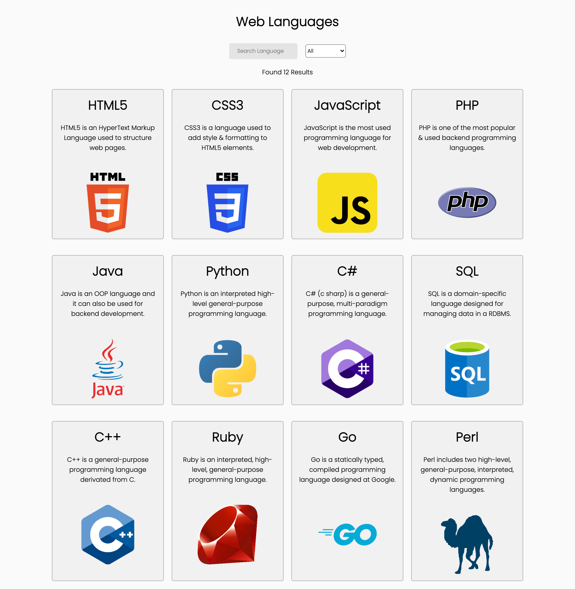
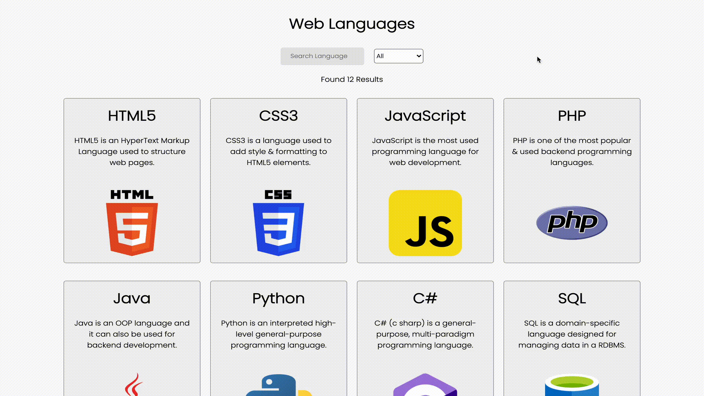

<!-- Title -->
<h1 align="center">React-Web-Languages</h1>

    It is a simple, fully-responsive, react application created to experiment/test components and filter features using the famous React library.  
    You can test this project at <a href="https://matteobaldassarre.github.io/react-web-languages/">this link</a>.

<!-- Overview -->
<h2 align="center">Overview</h2>

    All the data is sent to the website from a custom API created by myself and it is shown in the page as cards components.

<!-- Searching Languages By Name -->
<h3 align="center">Searching by Name</h3>

    You can filter languages by searching them and by typing their name as shown below.

<!-- Filtering Languages By Type -->
<h3 align="center">Filter Type</h3>

    You can also filter languages by their type (frontend, backend) and still search by name after the filter is applied.

